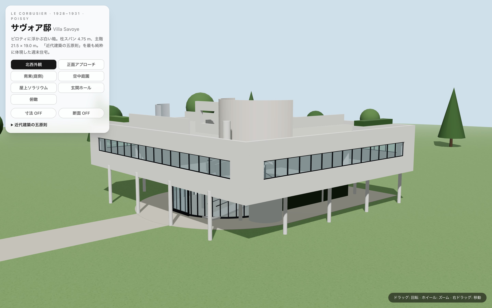
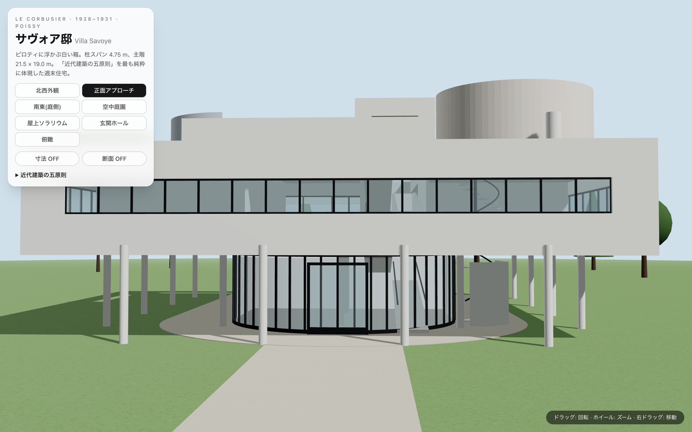
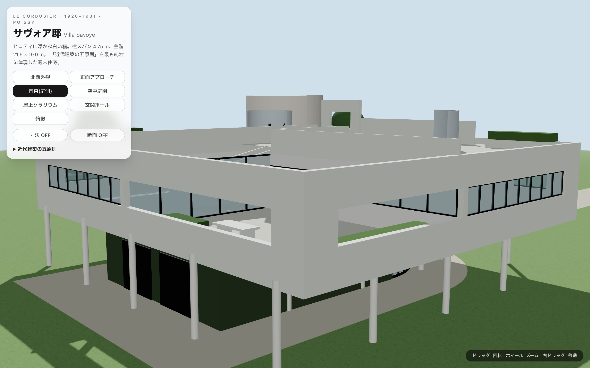
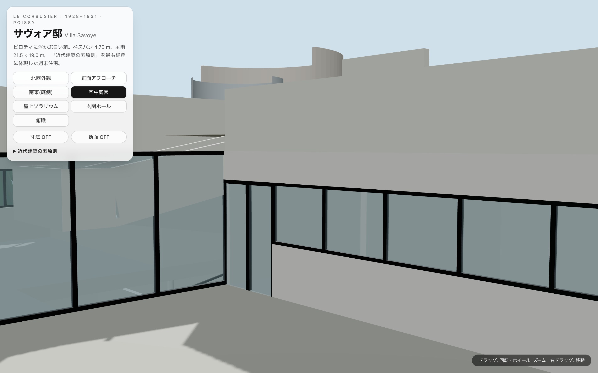
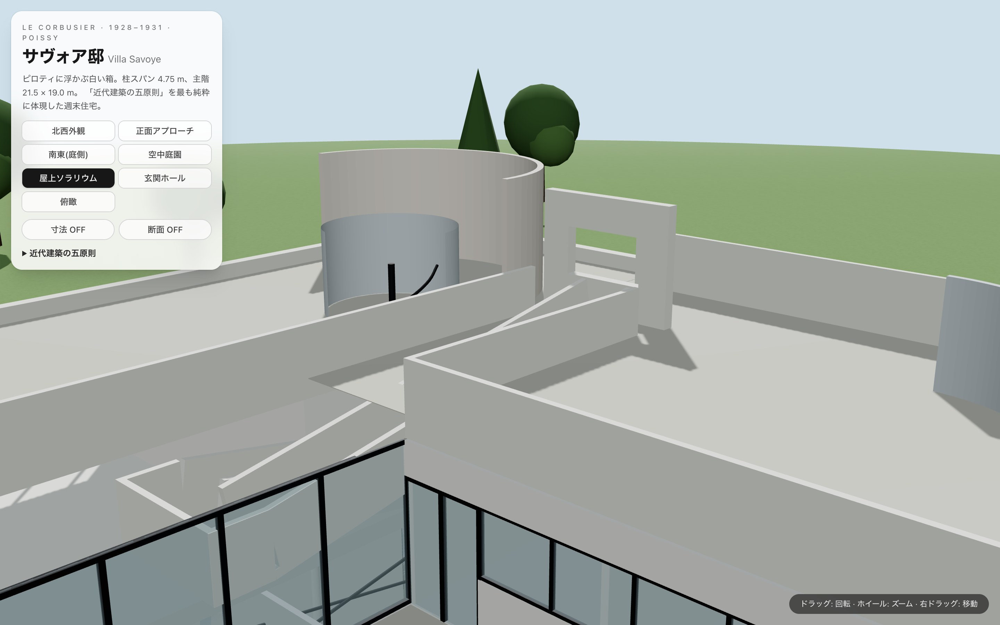
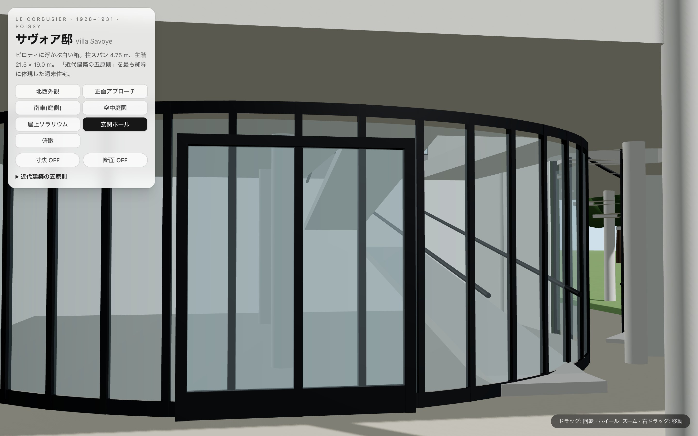
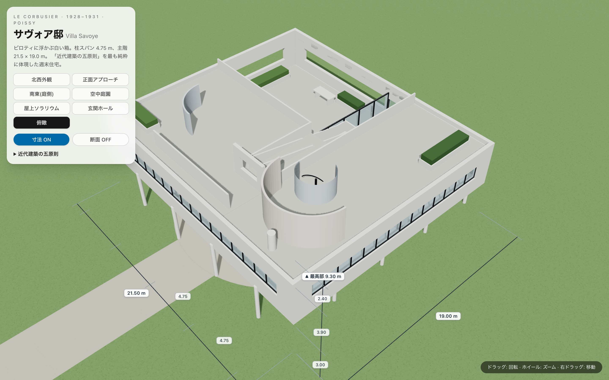
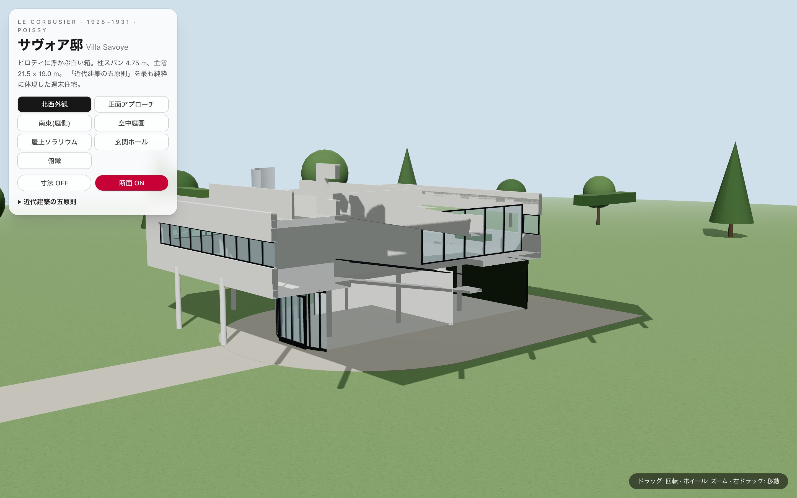

# Villa Savoye — サヴォア邸 3D 再現

ル・コルビュジエ+ピエール・ジャンヌレ《サヴォア邸》(1928–1931, フランス・ポワシー)を、
**Vite + React Three Fiber (three.js) + drei + Tailwind CSS** でブラウザ上に再現したインタラクティブ 3D モデルです。



**Live Demo:** https://y-migita.github.io/villa-savoye-fable/

## 特徴

- **実測寸法ベース** — 柱スパン 4.75 m グリッド、主階 21.5 × 19.0 m、ピロティ内法 3.0 m、
  全高 9.3 m など、公表されている実測値を `src/villa/dims.ts` に集約し、
  全ジオメトリをそこから組み立てています。
- **視点プリセット** — 北西外観 / 正面アプローチ / 南東(庭側) / 空中庭園 /
  屋上ソラリウム / 玄関ホール / 俯瞰 をワンクリックで巡回(CameraControls による滑らかな遷移)。
- **寸法表示** — 平面・高さの実寸を 3D 空間上に表示。
- **断面表示** — スロープを通る南北断面でプロムナード・アーキテクチュラルの積層を可視化。

## スクリーンショット

| | |
| --- | --- |
|  正面アプローチ |  南東(庭側) |
|  空中庭園 |  屋上ソラリウム |
|  玄関ホール |  俯瞰+寸法表示 |
|  断面表示 | |

## 再現している建築要素

「近代建築の五原則」との対応:

1. **ピロティ** — φ290 の円柱、4.75 m グリッド。北列のみ半スパンずらした 4 本で玄関の軸線を確保(実物準拠)
2. **屋上庭園** — ソラリウムの曲面風除け壁(ロゼ/ブルーグレーの淡彩)、スロープ到着点の「額縁」開口、植栽帯
3. **自由な平面** — サロンの全面ガラス引き壁、スロープ吹抜け、曲面の玄関ホール
4. **水平連続窓** — 四周を巡る帯窓。空中庭園ではガラスのない開口として続く
5. **自由な立面** — 1.25 m の持ち出しスラブによる薄い皮膜、緑に塗られた 1 階の後退壁

そのほか: 中央の 2 レーン折返しスロープ(屋内 1→2 階、屋外 2 階→屋上)、
1 階から屋上まで貫く螺旋階段、自動車の回転半径に由来する曲面ガラスの玄関ホール、
車庫、空中庭園の白いテーブル、煙突、敷地の車回しと並木。

## 主要寸法(モデル内で使用)

| 項目 | 値 |
| --- | --- |
| 構造グリッド(柱スパン) | 4.75 m |
| 主階平面 | 21.5 × 19.0 m(長手は両側 1.25 m 持ち出し) |
| ピロティ内法 | 3.0 m |
| 連続窓の帯 | 高さ 1.2 m(SL +4.4 〜 +5.6 m) |
| 屋上(第2の大地) | FL +6.55 m |
| 最高部(ソラリウム曲壁) | +9.3 m |

## 開発

```bash
npm install
npm run dev             # 開発サーバー
npm run build           # プロダクションビルド
node scripts/shots.mjs  # 各視点のスクリーンショットを docs/shots/ に一括生成
```

技術スタック: Vite / React 19 / three.js r185 / @react-three/fiber v9 / @react-three/drei v10 / Tailwind CSS v4

## 既知の簡略化

- 内部の間仕切り・家具は主要なもののみ(寝室・浴室などの詳細は省略)
- 建具の割付・巾木などのディテールは写真からの目測による近似
- 1 階の色彩は現在の修復状態(濃緑)を基準にした近似
- 敷地は象徴的な表現(実際の門番小屋・既存樹木の配置は再現していない)

## ライセンス

MIT License。教育・学習目的の再現です。オリジナルの建築は Fondation Le Corbusier が権利を管理しています。
